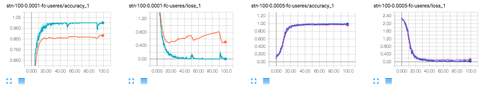
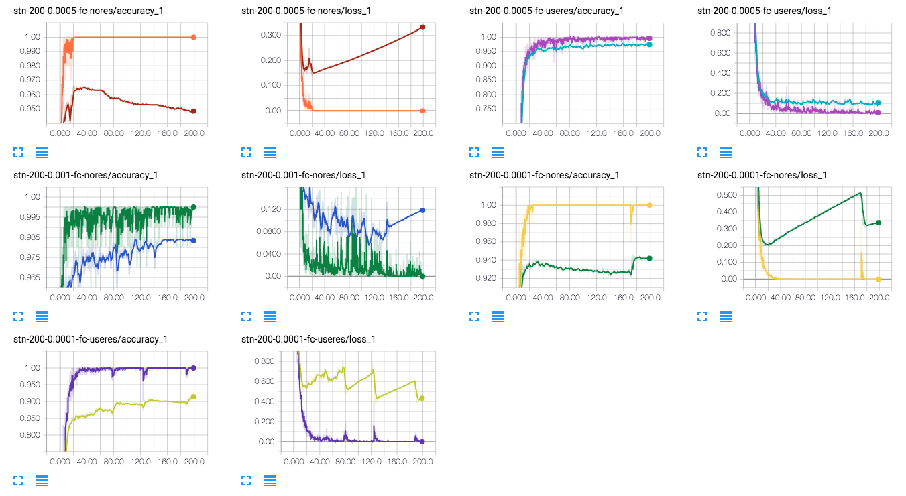
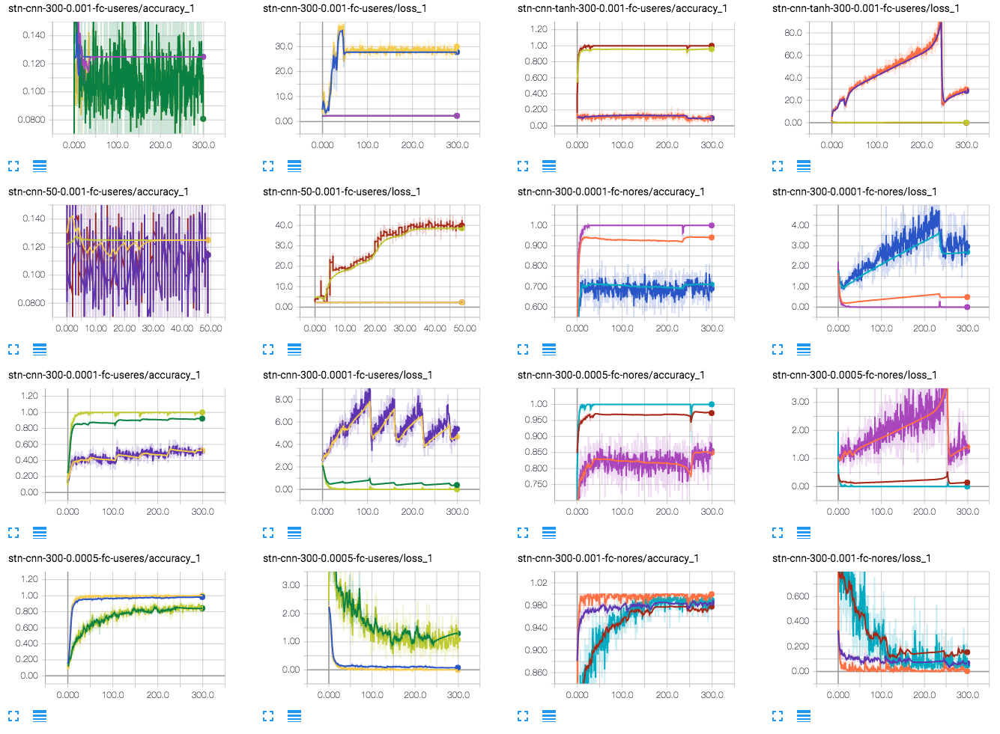
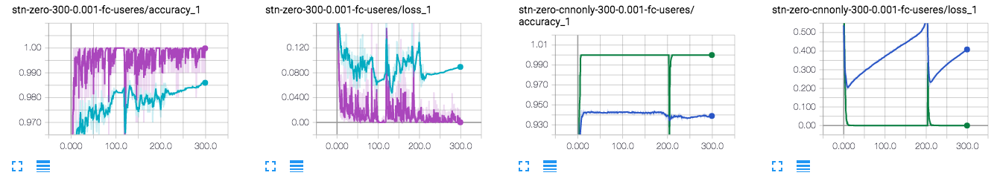

# Spatial Transformer Networks

Jaderberg, Max, Karen Simonyan, and Andrew Zisserman. "Spatial transformer networks." Advances in Neural Information Processing Systems. 2015.

* 이미지가 distorted 되어 있는 경우, 이걸 먼저 transformation 해서 잘 align 해 주고 그 뒤에 classification 을 하겠다는 것.  
* CNN 이 생각보다 이러한 distortion 에 invariant 하지 않다는 단점을 해결하고자 함.
* Main reference:
    * https://kevinzakka.github.io/2017/01/10/stn-part1/
    * https://github.com/kevinzakka/spatial_transformer_network

## Results

### 1. First question

일단 적당히 실험 결과는 나왔는데, 이게 왜 이렇게 러닝레잇에 따라서 결과가 크게 달라질까?

러닝레잇이 너무 크면 수렴하지 않는 건 당연히 그렇다 치더라도 (사실 이것도 진동 또는 발산조차 하지 않아서 이상했다. 나중에 그 이유를 알아냄), 왜 작으면 다른 값으로 수렴할까?

> useres 는 use residual connection 으로, M 을 계산할 때 마지막에 identity mapping 을 더해주는 걸 말한다. 별 의미는 없는 듯.

### 2. Various experiments

다양한 러닝레잇 & 커넥션 타입에 따른 실험 결과. residual connection 을 사용할 때에는 lr=0.0005 정도에서, 사용하지 않을 때에는 0.001 정도에서 가장 좋은 acc 값을 보였으며, 너무 작아지면 공통적으로 낮은 acc 값으로 수렴함을 볼 수 있었다.

여기서 가설을 세웠는데, TN (transformer networks) 과 CNN 의 학습 밸런스가 맞지 않을수 있다는 것이 바로 그것이다. TN 이 너무 잘 학습되어서 CNN 이 제대로 학습되지 않는다던가 (그래서 테스트셋에 대해서는 TN 이 완벽하게 얼라인을 못해주면 정확도가 떨어진다던가). 그래서 학습은 동일하게 시키되, 테스트할 때에는 CNN 만 사용해서 CNN 이 얼마나 잘 학습되었는지 테스트해보았다.

### 3. CNN tests

이 실험은 하고 나서 잘못되었다는걸 깨달은 게, TN 이 identity mapping 에서 많이 벗어나게 학습될수록 CNN 의 정확도는 당연히 떨어질 수 밖에 없다. 그래서 이건 오히려 TN 이 얼마나 identity mapping 에서 떨어져 있느냐를 보여주는 지표에 가깝다.

위에서 말한것처럼 lr=0.001 + residual connection 은 전혀 학습이 되지 않는다. 웃긴 건 테스트 어큐러시는 0.125로 수렴한다는 것이다. 이건 나중에야 알게 되었는데 이 경우 너무 TN이 팡팡 튀어서 이미지를 아예 없애 버린다. 그래서 제대로 된 gradient 가 넘어오지 않기 때문에 학습이 아예 안 되는 것 같다.

> 이 논리가 말이 되는건지 모르겠다.

그래서 이렇게 너무 튀는걸 막아주려고 tanh 제한도 걸어 보았다. 이 결과로 알수 있었던 건, tanh 를 걸어주면 범위 제한이 생기긴 하지만 마찬가지로 초반에 팡팡 튄다. 이 때문에 TN 이 이미지를 이상하게 align 했을 때, CNN 이 align 상태로 그냥 학습해 버려서 STN 이 위치를 조정할 수 없게 된다. 즉, TN + CNN 구조는 그냥 CNN 보다 훨씬 로컬 미니마에 빠지기 쉬운 상태가 되는 것이다. 이제 우리는 왜 이렇게 STN이 하이퍼파라메터에 따라 결과가 다르게 나오는지를 알았다!

여기서 관찰한 또다른 재밌는 점은, 성능이 좋은 경우는 대체로 CNN 의 성능도 좋다는 것이다. 정확도가 0.96 이상 나오는 0.0005-useres 나 0.001-nores 둘다 cnn 의 성능이 점점 좋아진다. 이건 실제로 CNN 의 성능이 좋은 게 아니라, TN 이 identity mapping 에서 크게 벗어나지 않는 매핑을 학습한다는 것을 의미한다. 즉, 다시 말해 이는 TN 이 학습하는 매핑이 최대한 identity mapping 에 가까워야 한다는 것이다. 이러한 prior 를 걸어주기 위해 여러 방법이 있겠지만, 가장 쉬운 방법으로 TN 의 weights init 를 0으로 해줌으로써 최대한 학습이 천천히 되게 구현하였다. 이는 참고 링크에서도 나오는 내용이다.

> 왜 W/b 가 전부 0 인데 학습이 되는가? 체크해봐야 함.

자, 그러면 또다른 궁금증이 하나 생긴다. TN 은 의미가 없고 단순히 CNN 이 좋아지는 거 아닌가? 아이덴티티 매핑을 학습하면 TN 이 의미가 없는데? 이 궁금증도 실험해 보았다.

### 4. STN vs CNN

동일한 네트워크 구조를 사용해서 TN 까지 사용한 STN 과 그냥 CNN 을 비교해보면 수렴 acc 가 0.986 vs. 0.938 로 STN이 확실히 좋게 나온다.

### 추가로 해볼만한 실험들

* 동일/더 많은 파라메터를 가지는 네트워크와 비교
  * 사실 그냥 CNN 보다는 훨씬 많은 파라메터를 사용하므로 당연히 좋아야 한다.
  * 그래서 더 많은 파라메터를 쓰는 allconv 도 구현했다.
  * 0.97 정도로 수렴하는거 같았는데 더 돌려봐야함.

## ToDo

* Why is the accuracy of STN significantly affected by learning rate?
    * 가설 1. 러닝 레잇에 따라서 STN 의 역할이 달라진다.
        * 즉, 러닝 레잇이 크면 STN 이 제대로 학습된다. 작으면 STN 이 학습될 틈도 없이 CNN 이 잘 학습되어버리기 때문에 잘 작동하지 않는 것이다.
    * 잘은 모르겠지만, STN 과 CNN 의 학습 밸런스가 안 맞는 것 같다.
        * 두 네트워크가 서로 적절히 학습이 되어야 하는데, 둘중 한놈이 먼저 피팅해 버리면 나머지 한놈이 제대로 학습이 되지 않는다.
        * 특히 데이터가 부족할 경우에, 한놈이 오버피팅(이라고 할 수 있는지 모르겠지만) 해 버리면 그 다음부터는 전혀 학습이 안 되는 것이다.
        * => STN 의 분산을 체크해보자. 분산이 큰 경우, 오버피팅이라고 할 수 있지 않을까. (M의)
    * 관찰
        * LR 이 작을 때,
            * M 이 크게 변하지 않는다. 즉, STN 이 제대로 학습되었는지 의문을 가질 수 있다.
            * 보통 처음 M 의 값이 큰데 (즉 identity func 에서 먼데), 이게 크게 변하지 않는다는 것은 transform 이 크게 된다는 것이다.
            * 이 때문에 cnn 또한 그냥 x_img 에 대해서는 좋은 성능을 내지 못한다.
            * 아무튼 이 과정이 train set 에 대해서는 좋은 성능을 내지만 높은 generalization error 를 갖는다.
            * 이는 어큐러시가 낮아졌다 올라가는 건 아니지만 오버피팅이라고 말할 수도 있을 것 같다.
        * LR 이 높을 때,
            * M 이 크게 변해서 identity function 과 비슷하게 되거나, 혹은 더 작게 가운데로 매핑한다.
            * cnn 의 정확도가 LR 이 작을 때에 비해 꽤 높이 올라온다.
            * 이는 transform 이 크지 않기 때문에 당연히 그럴수밖에 없다.
        * 확인해보고 싶은 것
            * cnn / stn+cnn 을 test set 에 대해서 돌렸을 때 결과 세트. 특히, cnn 은 틀리고 stn+cnn 은 맞춘걸 확인해보고 싶다.
            * M 에 제한을 걸어 준다면? 
            * 마지막 레이어에 tanh 혹은 2tanh 정도를 줘서 큰 변화가 없도록 하는 것도 괜찮지 않을까 싶음.
                * 이를 위해서는 affine transformation 에 대한 이해가 더 필요할 듯
                * 어느정도의 값이 어느정도의 변화를 이끌어내는지 
            * stn 에 zero init 을 안 했을 때 어떻게 되는지.
                * M 이 크게 널뛸 것이다
                * 이때 왜 학습이 안 되는가? (lr=0.001에서 안 됐었던것 같음)
    * 가설 2. STN 이 훨씬 학습에 민감하다.
        * 따라서, lr 을 작게 하면 STN 은 잘 학습이 되는데 cnn 이 학습이 잘 안되는 것.
        * lr 을 적당히 크게 하면 STN 도 학습이 잘 되고 cnn 도 학습이 잘 되는 그런 경계.
        * 이 문제를 해결하기 위해서는 lr 을 크게 주고 STN 에 제한을 걸어주면 될 것 같다. 
        * 그러면 lr 이 작을 때 training acc 가 1.0 으로 가는데 제너럴라이제이션 에러는 왜 큰가?
            * STN 은 잘 학습이 되는데 cnn 이 잘 학습이 안 된 경우.
            * 결국 분류기는 cnn이기 때문에 STN 이 잘 작동한다고 해도 cnn 이 구리면 성능이 안 나옴.
            * 흠... 가설일 뿐. 하지만 맞는 것 같다
* [x] tensorboard graph cleaning
* [ ] Summaries
  * [x] loss/accuracy scalar
    * [x] summary_dir arrange
    * [x] histogram for M
        * 시작값인 identity mapping 에서 어떻게 변하는가
        * 근데 이걸 알아보긴 좀 힘든 것 같다.
    * [x] image - input / transformed
    * [ ] text for # of params
    * [ ] compare models & allconv (last)
* allconv/stn 모델 분리하기
    * kkm 님 스타일로 분리해볼까...
    * 그냥 지금처럼 내비두고 그때그때 다른거 불러와서 학습시키는게 낫겠다.
    * 둘다 같이 돌리는건 좀 별로고.
* ETC
    * 그리고 위 영상 (devsummit) 보면 W/b 가 0일때 전혀 학습이 안 되는 경우가 있는데 이찬우님 얘기는 뭐였는지 확인해보고
        * 아마 레이어 하나만 0이면 괜찮은 그런 케이스가 아닐까 싶지만
        * 암튼 백프로파게이션 (직접 해 보면 좋고 아님 말고) 식으로 확인해보자

