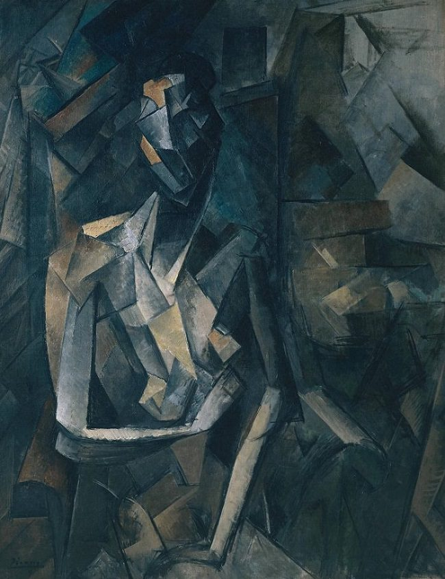

# Neural style

based on python 2.7, tensorflow 1.2

## Checklist

* Why origianl loss function does not work?
    * 다른건 다 오리지널 페이퍼 그대로 구현했는데 content_loss 가 이 경우 밸런스가 안 맞음.
    * content_weight 를 조절해서 맞춰줄 수야 있겠지만... 그냥 원본 페이퍼대로 안 되는 이유가 좀 궁금함.
* Why works differently?
    * refer code 와 동일한 것 같은데 결과가 살짝 다름.
    * 이유가 뭘까?

### Gatcha

* VGG in the computational graph
    * 이거 학습할 때 vgg network 도 학습되는거 아닌가...?
    * => 이건 아님! VGG network 에 파라메터들을 tf.variable 로 넣어준게 아니기때문에 trainable 하지 않다.
* Performances
    * Results
        * placeholder: 233s
        * constant: 148s (약 1.57배)
        * pre-calc: 148s (same)
    * Conclusions
        * placeholder 로 넣어주면 느린 건 크게 두 가지 이유가 있는데,
        * 1) 그래프 최적화가 안 됨
            * constant 로 넣으면 pre-calc 부분이 고정된 연산이므로 미리 최적화를 진행하는 듯
            * placeholder 로 넣으면 어떨지 모르니까 최적화가 불가능함
            * 아마 이게 성능 차이의 대부분을 차지할 듯
        * 2) feed\_dict 로 넣어주는 것 자체가 overhead 가 좀 있다고 들음
            * 그래서 성능향상을 위해 queue runner 를 사용함
            * 그래프에서 빠져나왔다 다시들어간다나 뭐 대충 그런식으로 들었던 것 같은데
        * pre-calc 에서 성능향상이 없었다는 것은 tensorflow computational graph 에 고정값 연산을 때려박으면 tf 가 알아서 잘 최적화해서 연산을 수행한다는 뜻
        * 즉, 걱정했던 부분인 optimization 과정 속에서 쓸데없는 iteration 이 발생하지 않는다는 것임

## Results

* 참고: 경복궁 이미지의 경우 default setting 인 max_size=512 로 수행한 결과이나 max_size=1200 정도로 늘려줄 경우 더 예쁘게 나옴.

<h3>flash.jpg</h3>
   

   

   

   

   

   

   

   

   
<h3>gbk.jpg</h3>
   

   

   

   

   

   

   

   

   
<h3>tubingen.jpg</h3>
   

   

   

   

   

   

   

   

   

## Main references

* Original paper
* https://github.com/hwalsuklee/tensorflow-style-transfer
* And more ++